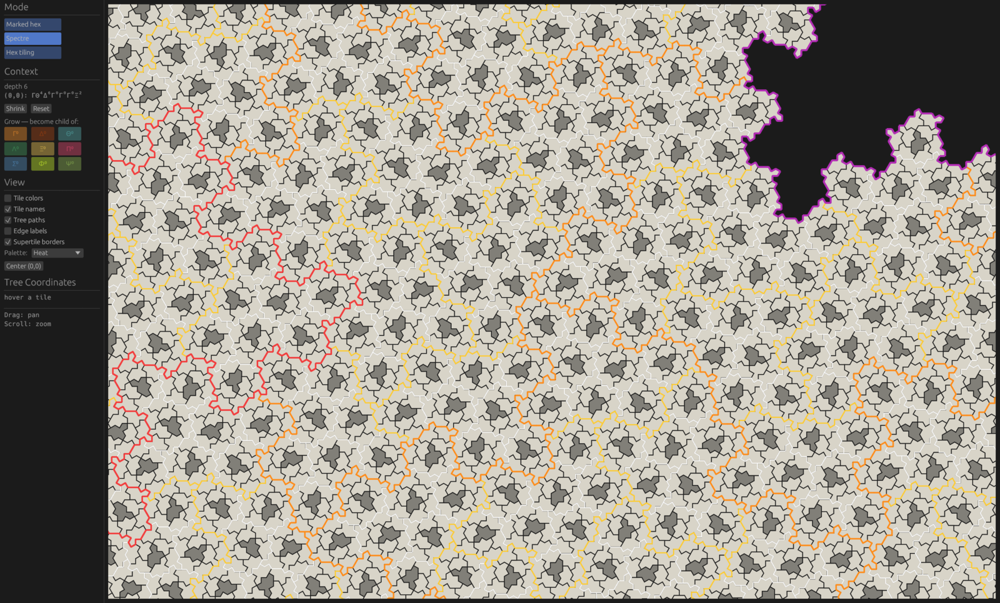

# spectre-tiling

A Rust playground for the [spectre](https://cs.uwaterloo.ca/~csk/spectre/) —
the aperiodic monotile discovered in 2023 — built around **combinatorial
coordinates**: tiles are tracked as paths through the substitution hierarchy,
and their neighbors are computed by a finite-state transducer instead of
geometry.



*Spectre mode at context depth 6: supertile borders colored and thickened by
order, the fractal patch rim at the top right, and the darker tiles marking
the 30°-rotated second halves of Γ's mystic pairs.*

## The explorer

```
cargo run --bin spectre_explorer
```

An egui app with three modes:

- **Marked hex** — the marked-hexagon metatile system drawn on a hex grid.  The
  only state is the tree coordinate of the tile pinned at hex (0, 0);
  everything visible is derived on the fly by the transducer and memoized as
  you pan.  The canvas starts empty: *grow* the context by picking the root
  tile, then repeatedly declaring the current top supertile to be some child
  of a larger one.  Growing never moves a tile that is already on screen —
  the patch just extends outward.  *Shrink* pops the outermost level back
  off.
- **Spectre** (default) — the same generated tiling realized as actual
  14-sided spectre tiles, placed by gluing in exact ℤ[exp(iπ/6)] arithmetic.
  Each hexagon carries one spectre, except Γ which carries the two-tile
  "mystic" pair.  Every tile is the same shape (never reflected), but the
  second tile of each pair — drawn darker — sits at an odd multiple of 30°
  where every other spectre sits at an even one.
- **Hex tiling** — a free-form editor over a stored tiling: place single
  marked tiles or whole supertiles, erase, validate edge labels, and apply
  the substitution to everything at once.

Paths are written root-first with child indices as superscripts: `ΔΓ⁰` is
child 0 (a Γ) of a Δ supertile; a trailing subscript `₀`/`₁` names which of
Γ's spectre pair is meant.  Supertile borders are drawn with thickness
growing in the order of the boundary (and optionally color-coded per order),
so the substitution hierarchy is visible at a glance.

Controls: drag to pan, scroll to zoom, left/right click to place/erase in
Hex-tiling mode (`Q`/`E` rotate the brush).  The View section toggles
colors, names, paths, edge labels and borders, and picks the border-order
palette (plain, heat, ice, viridis, or gold fade).

## Library layout

| Module | Contents |
| --- | --- |
| `hex` | Axial-coordinate hex grid: `Hex`, the six `DIRECTIONS`, rotations. |
| `marked` | `MarkedTile`/`MarkedTiling`: hexes with labeled edges and the matching rule `x == -y`. |
| `spectre` | The 9 marked metatiles Γ Δ Θ Λ Ξ Π Σ Φ Ψ over the edge alphabet ±α…η. |
| `supertile` | The 9 level-1 supertile patches and their anchor vertices. |
| `tiling` | The substitution: `supersubstitute*` stitches supertiles by anchor geometry; plus a greedy patch generator. |
| `tree_coords` | `TreeCoords` paths, the `SUPERTILE_CHILDREN` table, patch boundary decomposition into super-edges, the edge-adjacency closure, and the recursive neighbor algorithm. |
| `transducer` | The deterministic finite-state transducer (279 states) that maps a tile's path to its neighbor's path in one leaf-to-root pass, plus `border_order`. |
| `spectre_geom` | Geometric realization: exact points in ℤ[d] with d = exp(iπ/6), the rigid spectre outline, and the hexagon↔spectre transition tables. |

The implementation follows Simon Tatham's two articles (summarized under
`references/`): the recursive neighbor algorithm comes from
[*Combinatorial coordinates for the aperiodic Spectre tiling*](https://www.chiark.greenend.org.uk/~sgtatham/quasiblog/aperiodic-spectre/),
and the transducer construction from
[*Working with aperiodic tilings using finite-state transducers*](https://www.chiark.greenend.org.uk/~sgtatham/quasiblog/aperiodic-transducers/).
The hexagon→spectre tables in `spectre_geom` are derived from the tables in
Tatham's [puzzle collection](https://www.chiark.greenend.org.uk/~sgtatham/puzzles/)
(`spectre-tables-auto.h`), whose conventions provably coincide with this
repo's.  The metatile system itself is from Smith, Myers, Kaplan and
Goodman-Strauss, [*A chiral aperiodic monotile*](https://arxiv.org/abs/2305.17743).

## Tests

```
cargo test
```

The test suite cross-checks every layer against the one below it: the
hand-written supertile patches against the substitution, the recursive
neighbor algorithm against raw patch geometry (up to ~27k-tile patches), the
transducer against the recursive algorithm (including deep random paths and
gluing/reciprocity invariants), and the spectre realization against
route-independence of BFS gluing over whole patches.

## License

Licensed under either of

- Apache License, Version 2.0 ([LICENSE-APACHE](LICENSE-APACHE) or
  http://www.apache.org/licenses/LICENSE-2.0)
- MIT license ([LICENSE-MIT](LICENSE-MIT) or
  http://opensource.org/licenses/MIT)

at your option.

Unless you explicitly state otherwise, any contribution intentionally
submitted for inclusion in the work by you, as defined in the Apache-2.0
license, shall be dual licensed as above, without any additional terms or
conditions.
